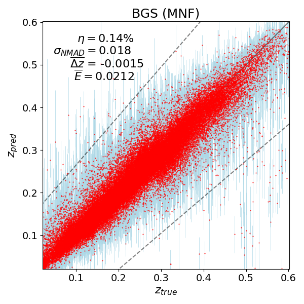
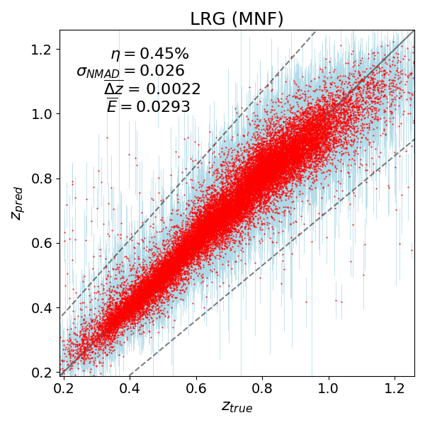
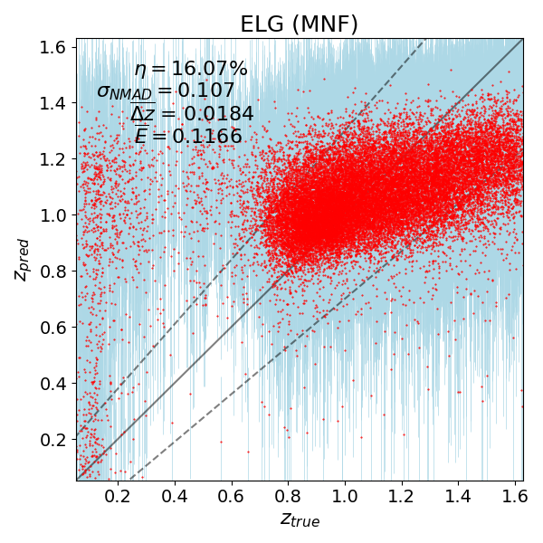
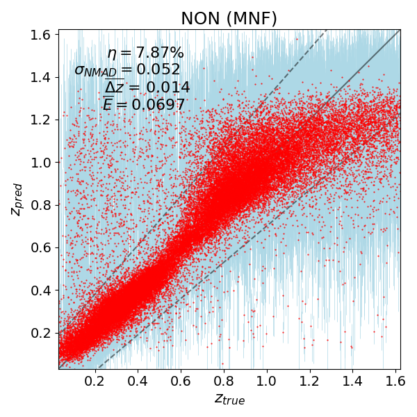



# Photometric Redshifts for Chinese Space Station Telescope

# Foreground Removal for CO Line Intensity Mapping

# Redshift Estimation for Chinese Space Station Telescope

# DESI Photo-z Catalogue

DESI Legacy Surveys, encompassing three different surveys, MzLS, DECaLS and BASS, are the foundations of DESI spectroscopic survey. Since accurate spectroscopic redshifts cannot be measured by all galaxies, but only a fraction of them, the photometric redshifts (photo-\\(z\\)s) are still necessary for astronomical and cosmological studies. Commonly, photo-\\(z\\)s can be estimated from photometric measurements in several bands, for example from magnitudes and colors. However, the emergence of convolutional network (CNN) provides us another routine by directly estimating photo-\\(z\\)s from imaging data. This approach can naturally incorporate the morphological informations from galaxy images to enhance the accuracy of redshift estimations. Furthermore, due to the equal importance of uncertainties, CNN can be built in Bayesian framework as Bayesian neural networks (BNN) to account for the epistemic uncertainties from network models and aleatoric uncertainties from data.  
In this work, we train the BNNs built upon Multiplicative Normalizing Flows (MNF, [Github](https://github.com/janosh/tf-mnf)) utilizing galaxy images in 3 optical bands from DESI Legacy Surveys (DESI LS) and 2 infrared bands from Wide-field Infrared Survey Explorer (WISE) and corresponding spectroscopic redshifts from the DESI early data release (DESI-EDR), leveraging the high quality and accurate measurements of spec-\\(z\\)s by DESI.  
We found that categorizing the sources into different groups based on their charateristics and estimating their photo-\\(z\\)s within their groups separately provides enhanced accuracy compared to estimating them collectively. Here we categorize the sources into four groups: Bright Galaxy Sample (BGS), Luminous Red Galaxies (LRG), Emission Line Galaxies (ELG) and a group including the remaining sources, referred as NON, based on target selections of DESI. The target selections are neccesary for ongoing and planned spectroscopic surveys, since the spec-\\(z\\)s cannot be accurately measured for all sources in a limited exposure time. Target selections are utilized to select the certain sources with obvious spectroscopic features for straightforward spec-\\(z\\) measurements, and they are performed using photometric measurements. DESI LS are utilized for target selections of DESI. Therefore, we categorize the sources into four groups based on endeavors of DESI target selections.  
With outliers defined as \\(|\Delta z| > 0.15(1 + z_{\rm true})\\), accuracy as \\(\sigma_{\rm NMAD}\\), mean bias \\(\bar{\Delta z}\\) and mean uncertainty \\(bar{E}\\), we obtain the following results for four groups of sources: 
 
 

And we employ UMAP to analyze the deeper reasons for the distinct behaviors for these groups. The UMAP is created using the 5 magnitudes and half light radius to mimic the method of deriving redshifts from imaging data. They are displayed below:  

We notice good correlations between the reduced 2d positions and redshifts for BGS and LRG. Contrary, correlations are less pronouced for ELG. Interestingly, NON is divided to 2 parts, with one resembling the ELG, and the other one having good correlations.  

Furthermore, we analyze the photo-\\(z\\) accuracy with respect to galaxy morphological classifications. The classifications are produced in photometry measurements by in model fitting by Tractor. The following figure displays the distribution of half-light radius for four classifications and the mean bias with respect to the radius. This analysis demonstrates that larger radius offers higher precision, as more features can be utilized for sources with larger radius. And SER commonly has more large radius, rendering higher accuracy, followed by DEV, EXP and REX. 

# galaxyEmulator

Galaxy can be emulated using magneto-hydrodynamical simulations by assigning each particle with a SED using radiative transfer code, instead of
adopting empirical method, such as Halo occupation distributions (HODs).  
We build a Python wrapper to emulate galaxies, involving complete routine from preprocessing to postprocessing, from IllustrisTNG using SKIRT.
Preprocessing extracts stellar and dust particles from IllustrisTNG, assigns SED to them by astronomical parameters, such as mass, metallicity and so on, and executes the SKIRT code. On the other hand, postprocessing applies instrumental and observational effects, including point spread functions (PSFs) and background noises for specific instruments.  
This project serves as the foundations for addressing other interesting works including deblending analysis and galaxy parameter estimations.  
Our code is publicly available at [Github](https://github.com/xczhou-astro/galaxyEmulator) and relevant paper is still drafting. 