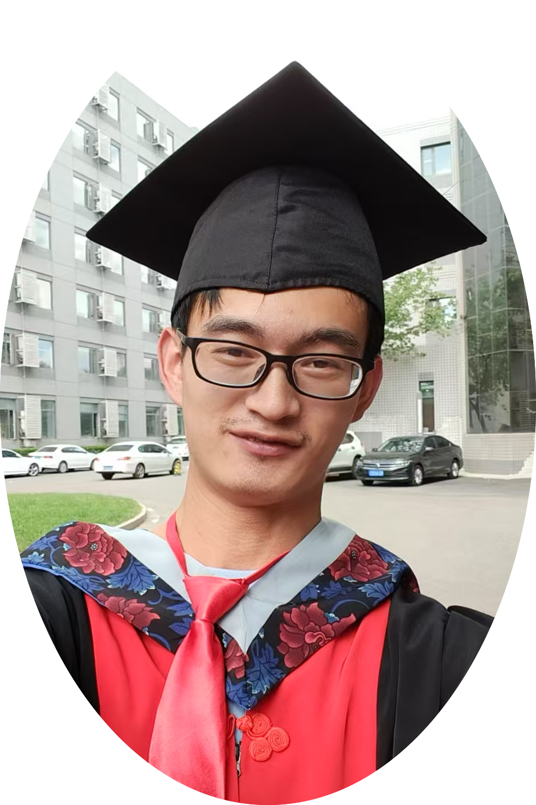

    

        
        

## Contact
* <i class="fas fa-envelope"></i> [xczhou95@gmail.com](mailto:xczhou95@gmail.com)
* <i class="fas fa-map-marker-alt"></i> NAOC, Beijing, China

## Social Links
* <i class="fab fa-github"></i> [GitHub](https://github.com/xczhou-astro)
* <i class="ai ai-orcid"></i> [ORCID](https://orcid.org/0000-0001-7283-1100)

## Downloads
* <i class="fas fa-file-pdf"></i> <a href="../documents/Xingchen-Zhou-CV.pdf" target="_blank" rel="noopener noreferrer">Download CV</a>
* <i class="fas fa-file-alt"></i> <a href="../documents/Research_statement_Xingchen_Zhou.pdf" target="_blank" rel="noopener noreferrer">Research Statement</a>
+ 
Last updated: December 2024

        

    

    

# About Me

I am Xingchen Zhou (中文名：周兴晨). My name, Xingchen, shares the same pronunciation as “stars” in Chinese, which feels like destiny since I’ve always had a deep love for the night sky. From a young age, I was determined to study astronomy, and in the summer of 2023, I reached a major milestone by earning a PhD in Astrophysics from NAOC. My doctoral research focused on applying deep learning techniques to data analysis in photometric and spectroscopic surveys. I am now continuing my work as a research assistant in the CSST Scientific Application Group at NAOC.

## Educations
* **Ph.D. in Astrophysics** (2018 ~ 2023)  
  NAOC, Beijing, China  
  Dissertation: "Applications of Deep Learning in Galaxy and Line Intensity Mapping Surveys"  
  Supervisor: Prof. Yan Gong  

   

* **B.S. in Physics** (2014 ~ 2018)  
  Dalian University of Technology, Dalian, China

## Employments
* **Research assistant** (2024 ~ Present)  
  NAOC, Beijing, China

## Skills:
* **Programming:**
Python, TensorFlow, PyTorch (Skilled); C/C++ (Basic)

 

* **Languages:**
English(Proficient); Chinese(Native); Japanese(N2)

## Research Interests
* Machine learning and deep learning
* Photometric and spectroscopic data analysis
* Galaxy morphology
* Line intensity mapping
    

 

<!-- 

    <a href="https://github.com/xczhou-astro" target="_blank"><i class="fab fa-github"></i></a>
    <a href="mailto:xczhou@tsinghua.edu.cn"><i class="fas fa-envelope"></i></a>
    <a href="https://scholar.google.com/citations?user=YOUR_ID" target="_blank"><i class="ai ai-google-scholar"></i></a>

    <a href="documents/CV.pdf" class="download-button" target="_blank">
        <i class="fas fa-file-pdf"></i> Download CV
    </a>
    <a href="documents/Research_Statement.pdf" class="download-button" target="_blank">
        <i class="fas fa-file-alt"></i> Research Statement
    </a>

  -->